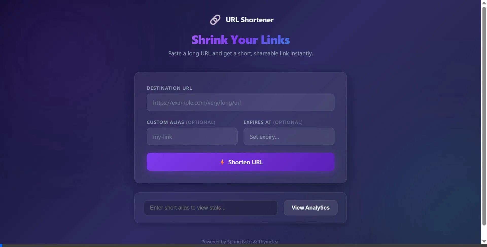

# 🔗 URL Shortener

A full-stack, enterprise-grade URL shortening service built with **Spring Boot** and **Thymeleaf**, backed by **PostgreSQL** for persistence and **Redis** for caching and rate limiting.

<p align="center">
  
</p>


---

## ✨ Features

- **Shorten URLs** — Paste a long URL, get a short shareable link instantly.
- **Custom Aliases** — Choose your own short code (1–8 chars) with strict alphanumeric security validation.
- **Expiration Dates** — Set an optional expiry date/time.
- **Advanced Analytics** — Real-time tracking of clicks, device types, browsers, operating systems, and referrers via the `/stats/{alias}` dashboard.
- **Redis Caching** — Lightning-fast bidirectional caching (`short→long`, `long→short`) to reduce database load.
- **Global Rate Limiting** — Redis-backed Bucket4j rate limiting blocks API abuse.
- **Background Cleanup** — Scheduled CRON jobs automatically wipe expired URLs and analytics from the PostgreSQL DB and flush them from the Redis cache.
- **Database Migrations** — Flyway integration for seamless database schema progression and version control.
- **Web UI** — Beautiful dark-themed Thymeleaf interface with an interactive date-picker and a premium Glassmorphism aesthetic.
- **Input Validation** — Strict Regex validation mapped to Thymeleaf `BindingResult` to block XSS and prevent Open-Redirect vulnerabilities.
- **100% Code Coverage** — Backed by comprehensive isolated unit tests verified via Jacoco.

<p align="center">
  
</p>

---

## 🛠️ Tech Stack

| Layer                 | Technology                                      |
| --------------------- | ----------------------------------------------- |
| Backend               | Java 17, Spring Boot 4                          |
| Web UI                | Thymeleaf, HTML/CSS (Inter font, Glassmorphism) |
| Database              | PostgreSQL 15                                   |
| Cache & Rate Limiting | Redis (Bucket4j)                                |
| ORM                   | Spring Data JPA / Hibernate                     |
| Schema Management     | Flyway                                          |
| Build & Testing       | Maven, JUnit 5, Mockito, Jacoco                 |
| Containers            | Docker Compose                                  |

---

## 🚀 Getting Started

### Prerequisites

- Java 17+
- Maven 3+
- Docker & Docker Compose

### 1. Start Infrastructure

```bash
docker-compose up -d
```

This starts:
- **PostgreSQL** on `localhost:5431`
- **Redis** on `localhost:6379`

### 2. Run the Application

```bash
./mvnw spring-boot:run
```

The app starts at **http://localhost:8080** and Flyway will automatically run the database migrations!

### 3. Open the UI

Navigate to **http://localhost:8080** in your browser to use the web interface.

---

## 🌐 Web UI

The application includes a premium dark-themed web interface:

- **Shorten form** — destination URL, optional custom alias, interactive expiration picker.
- **Analytics Dashboard** — Built-in layout tracking views over time.
- **Result card** — displays the generated short URL with a one-click copy button.
- **Error handling** — inline error messages for alias conflicts and validation errors.

---

## 📡 REST API

Base URL: `http://localhost:8080`

### Create Short URL

```http
POST /api/urls
Content-Type: application/json

{
  "longUrl": "https://example.com/very/long/path",
  "customAlias": "my-link",
  "expirationTime": "2026-12-31T23:59:59"
}
```

| Field            | Required | Description                                       |
| ---------------- | -------- | ------------------------------------------------- |
| `longUrl`        | ✅        | Target URL to shorten                             |
| `customAlias`    | ❌        | Desired short code (1–8 chars, Alphanumeric only) |
| `expirationTime` | ❌        | ISO-8601 datetime for expiry                      |

**Response** (`201 Created`):

```json
{
  "shortUrl": "http://localhost:8080/api/urls/aB3xYz1",
  "shortCode": "aB3xYz1",
  "longUrl": "https://example.com/very/long/path",
  "expirationTime": "2026-12-31T23:59:59"
}
```

**Error Messages**:
- `409 Conflict`: returned when custom alias already exists.
- `400 Bad Request`: returned when Regex validation fails.
- `429 Too Many Requests`: returned when rate limiting blocks the IP.

### Redirect Short URL

```http
GET /api/urls/{shortCode}
```

| Status          | Condition                                   |
| --------------- | ------------------------------------------- |
| `302 Found`     | Active, not expired → redirects to long URL |
| `410 Gone`      | Expired → marks URL inactive                |
| `404 Not Found` | Short code doesn't exist                    |

---

## ⚙️ Configuration

All config lives in `src/main/resources/application.yaml`:

| Property                 | Default                                          |
| ------------------------ | ------------------------------------------------ |
| Server port              | `8080`                                           |
| PostgreSQL URL           | `jdbc:postgresql://localhost:5431/url_shortener` |
| PostgreSQL user          | `url_shortener_user`                             |
| Redis host/port          | `localhost:6379`                                 |
| Base URL for short links | `http://localhost:8080/api/urls`                 |
| Bucket4j Limits          | `20 requests per minute per IP`                  |
| Cleanup Cron             | `0 0 * * * *` (Runs hourly)                      |

---

## 🧪 Testing

```bash
./mvnw clean verify
```

The application features **100% test coverage**. 
Tests cover:
- **UrlControllerTest** — REST endpoint behavior (redirect, not found, expired, conflict).
- **WebControllerTest** — Thymeleaf template rendering and form validation.
- **UrlServiceTest** — Core logic (Base62 encoding, caching, expiration processing).
- **CleanupServiceTest** — Ensures the automated cron jobs flush expired entities properly.
- **AnalyticsServiceTest** — Ensures clicks and metadata are mapped accurately to short codes.

---

## 📁 Project Structure

```
src/main/java/com/example/URLShortener/
├── UrlShortenerApplication.java        # Entry point
├── controllers/
│   ├── urlController.java              # REST API controller
│   └── WebController.java             # Thymeleaf web UI controller
├── dto/
│   ├── URLRequest.java                # Request DTO
│   └── URLResponse.java              # Response DTO
├── models/
│   ├── URL.java                       # JPA entity
│   └── ClickEvent.java                # Analytics data model
├── repository/
│   ├── UrlRepository.java            # URLs Spring Data repository
│   └── ClickEventRepository.java     # Analytics Spring Data repository
└── services/
    ├── UrlService.java                # Core URL business logic
    ├── AnalyticsService.java          # Analytics processing logic
    ├── CleanupService.java            # Background scheduler
    └── Base62Encoder.java             # Short code generator

src/main/resources/
├── application.yaml                   # App configuration
├── db/migration/                      # Flyway SQL schemas
└── templates/
    ├── index.html                     # Thymeleaf web UI
    └── analytics.html                 # Built-in stats dashboard
```

--- 

## 📝 License

This project is open source and available under the [MIT License](LICENSE).
