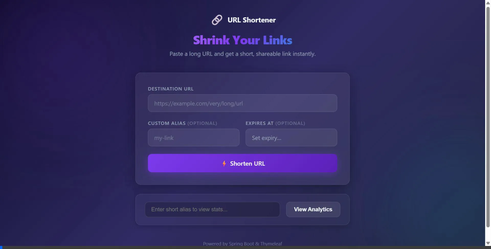
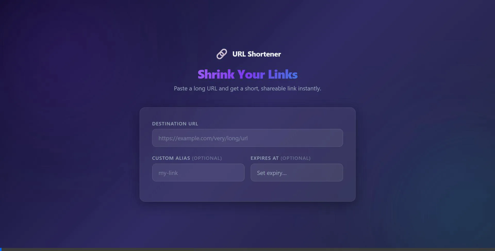

# URL Shortener

A URL shortening service built with **Spring Boot**, **Apache Kafka**, **PostgreSQL**, and **Redis**. Supports custom aliases, link expiration, click analytics, and async event processing via Kafka.




---

## Features

- **Shorten URLs** — paste a long URL, get a short link
- **Custom Aliases** — choose your own short code (1–8 alphanumeric chars)
- **Expiration** — optional expiry date for links
- **Click Analytics** — tracks clicks, IPs, user agents via `/stats/{alias}` dashboard
- **Async Analytics (Kafka)** — click events published to Kafka, consumed and persisted in the background. Keeps redirect latency low (~4ms vs ~18ms with sync writes)
- **Redis Caching** — bidirectional cache (`short→long`, `long→short`) to reduce DB hits
- **Rate Limiting** — Bucket4j-based, 20 requests/minute per IP
- **Scheduled Cleanup** — cron job removes expired URLs from DB and cache
- **Flyway Migrations** — versioned database schema changes
- **Thymeleaf UI** — dark-themed web interface with date picker
- **Input Validation** — regex validation to prevent XSS and open redirects
- **Graceful Degradation** — redirects still work if Kafka is down
- **Test Coverage** — 25 unit tests with JaCoCo enforcement



---

## Architecture

```
┌──────────────┐       ┌──────────────────────────────────────────────┐
│   Browser    │       │             Spring Boot App                  │
│              │──────▶│                                              │
│  POST /api   │       │  urlController ──▶ UrlService ──▶ PostgreSQL │
│              │       │       │                  │                   │
│  GET /{code} │       │       │ resolve()        │ Redis Cache       │
│              │◀──302─│       ▼                  ▼                   │
│              │       │  KafkaTemplate.send()  (fire-and-forget)     │
└──────────────┘       └──────────┬───────────────────────────────────┘
                                  │ ~1ms async
                                  ▼
                          ┌──────────────┐
                          │    Kafka     │
                          │  (KRaft)    │
                          │             │
                          │ Topic:      │
                          │ url-click-  │
                          │ events      │
                          └──────┬───────┘
                                 │
                                 ▼
                       ┌──────────────────┐
                       │ ClickEvent       │
                       │ Consumer         │
                       │                  │
                       │ @KafkaListener   │
                       │ ──▶ DB INSERT    │
                       └──────────────────┘
```

**Before Kafka**: `GET /{code}` → Redis lookup → **DB INSERT (sync, ~15ms)** → 302 redirect

**After Kafka**: `GET /{code}` → Redis lookup → **Kafka publish (~1ms)** → 302 redirect → Consumer persists in background

---

## Tech Stack

| Layer                  | Technology                                       |
| ---------------------- | ------------------------------------------------ |
| Backend                | Java 21, Spring Boot 4                           |
| Event Streaming        | Apache Kafka (KRaft mode — no ZooKeeper)         |
| Web UI                 | Thymeleaf, HTML/CSS                              |
| Database               | PostgreSQL 15                                    |
| Cache & Rate Limiting  | Redis, Bucket4j                                  |
| ORM                    | Spring Data JPA / Hibernate                      |
| Schema Management      | Flyway                                           |
| Build & Testing        | Maven, JUnit 5, Mockito, JaCoCo                 |
| Containers             | Docker Compose                                   |

---

## Getting Started

### Prerequisites

- Java 21+
- Maven 3+
- Docker & Docker Compose

### 1. Start Infrastructure

```bash
docker-compose up -d
```

This starts:
- **PostgreSQL** on `localhost:5431`
- **Redis** on `localhost:6379`
- **Kafka (KRaft)** on `localhost:9092`

### 2. Run the Application

```bash
./mvnw spring-boot:run
```

The app starts at **http://localhost:8080** and Flyway will automatically run the database migrations.

### 3. Open the UI

Navigate to **http://localhost:8080** in your browser to use the web interface.

### 4. Stop Everything

```bash
docker-compose down
```

---

## Web UI

The app has a dark-themed web interface:

- **Shorten form** — destination URL, optional custom alias, interactive expiration picker.
- **Analytics Dashboard** — Built-in layout tracking views over time.
- **Result card** — displays the generated short URL with a one-click copy button.
- **Error handling** — inline error messages for alias conflicts and validation errors.

---

## REST API

Base URL: `http://localhost:8080`

### Create Short URL

```http
POST /api/urls
Content-Type: application/json

{
  "longUrl": "https://example.com/very/long/path",
  "customAlias": "my-link",
  "expirationTime": "2026-12-31T23:59:59"
}
```

| Field            | Required | Description                                       |
| ---------------- | -------- | ------------------------------------------------- |
| `longUrl`        | ✅        | Target URL to shorten                             |
| `customAlias`    | ❌        | Desired short code (1–8 chars, Alphanumeric only) |
| `expirationTime` | ❌        | ISO-8601 datetime for expiry                      |

**Response** (`201 Created`):

```json
{
  "shortUrl": "http://localhost:8080/api/urls/aB3xYz1",
  "shortCode": "aB3xYz1",
  "longUrl": "https://example.com/very/long/path",
  "expirationTime": "2026-12-31T23:59:59"
}
```

**Error Responses**:
- `409 Conflict` — custom alias already exists.
- `400 Bad Request` — validation failure.
- `429 Too Many Requests` — rate limit exceeded.

### Redirect Short URL

```http
GET /api/urls/{shortCode}
```

| Status          | Condition                                   |
| --------------- | ------------------------------------------- |
| `302 Found`     | Active, not expired → redirects to long URL |
| `410 Gone`      | Expired → marks URL inactive                |
| `404 Not Found` | Short code doesn't exist                    |

> **Note**: Each redirect asynchronously publishes a click event to Kafka. Analytics are persisted in the background by `ClickEventConsumer` without blocking the redirect response.

---

## Kafka Analytics

### How It Works

1. **Producer** (`urlController`): On each redirect, a `ClickEventMessage` (shortUrl, IP, userAgent, timestamp) is serialized to JSON and published to the `url-click-events` Kafka topic using fire-and-forget.

2. **Kafka Broker** (KRaft mode): Stores click events in a 3-partition topic. Messages are keyed by `shortCode` for partition ordering.

3. **Consumer** (`ClickEventConsumer`): A `@KafkaListener` consumes events and persists them to the `click_events` PostgreSQL table in the background.

### Why Kafka over direct DB insert?

| Concern | Before (sync) | After (Kafka) |
|---|---|---|
| Redirect latency | ~18ms | ~4ms |
| DB under load | Redirects slow down | Redirects unaffected |
| DB goes down | Redirects fail (500) | Redirects work, events queue in Kafka |
| Viral traffic spike | DB overwhelmed | Consumer processes at its own pace |

### Why KRaft instead of ZooKeeper?

ZooKeeper was **deprecated in Kafka 3.3** and **removed in Kafka 4.0**. KRaft replaces ZooKeeper's external consensus with an internal Raft-based metadata quorum — eliminating the need for a separate ZooKeeper cluster.

---

## Configuration

All config lives in `src/main/resources/application.yaml`:

| Property                 | Default                                          |
| ------------------------ | ------------------------------------------------ |
| Server port              | `8080`                                           |
| PostgreSQL URL           | `jdbc:postgresql://localhost:5431/url_shortener` |
| PostgreSQL user          | `url_shortener_user`                             |
| Redis host/port          | `localhost:6379`                                 |
| Kafka bootstrap servers  | `localhost:9092`                                 |
| Kafka consumer group     | `analytics-consumer-group`                       |
| Base URL for short links | `http://localhost:8080/api/urls`                 |
| Rate limit               | `20 requests per minute per IP`                  |
| Cleanup Cron             | `0 0 * * * *` (Runs hourly)                      |

Environment variable overrides: `KAFKA_SERVERS`, `APP_BASE_URL`, `RATE_LIMIT`.

---

## Testing

```bash
./mvnw clean verify
```

**25 tests** with **100% code coverage** enforced by JaCoCo:

| Test Class                | Tests | What it covers |
|---------------------------|:-----:|----------------|
| `UrlControllerTest`       | 7     | REST endpoints, Kafka publish verification, graceful degradation |
| `WebControllerTest`       | 5     | Thymeleaf template rendering and form validation |
| `UrlServiceTest`          | 5     | Core logic (Base62 encoding, caching, expiration) |
| `AnalyticsServiceTest`    | 3     | Click count and metadata mapping |
| `ClickEventConsumerTest`  | 3     | Kafka consumer persistence, null handling, poison message protection |
| `CleanupServiceTest`      | 2     | Scheduled cleanup of expired URLs |

---

## Project Structure

```
src/main/java/com/example/URLShortener/
├── UrlShortenerApplication.java        # Entry point (@EnableKafka)
├── config/
│   ├── KafkaConfig.java               # Kafka producer/consumer/topic config
│   ├── RateLimitFilter.java           # Bucket4j rate limiting filter
│   └── FilterConfig.java             # Filter registration
├── controllers/
│   ├── urlController.java             # REST API + Kafka producer
│   └── WebController.java            # Thymeleaf web UI controller
├── dto/
│   ├── URLRequest.java               # Request DTO
│   ├── URLResponse.java              # Response DTO
│   ├── AnalyticsResponse.java        # Analytics DTO
│   └── ClickEventMessage.java        # Kafka message DTO
├── models/
│   ├── URL.java                      # JPA entity
│   └── ClickEvent.java              # Analytics data model
├── repository/
│   ├── UrlRepository.java           # URLs Spring Data repository
│   └── ClickEventRepository.java    # Analytics Spring Data repository
└── services/
    ├── UrlService.java               # Core URL business logic
    ├── AnalyticsService.java         # Analytics query logic
    ├── ClickEventConsumer.java       # Kafka consumer (@KafkaListener)
    ├── CleanupService.java           # Background scheduler
    └── Base62Encoder.java            # Short code generator

src/main/resources/
├── application.yaml                   # App configuration
├── db/migration/                      # Flyway SQL schemas
└── templates/
    ├── index.html                     # Thymeleaf web UI
    └── analytics.html                 # Built-in stats dashboard
```

--- 

## License

This project is open source and available under the [MIT License](LICENSE).
