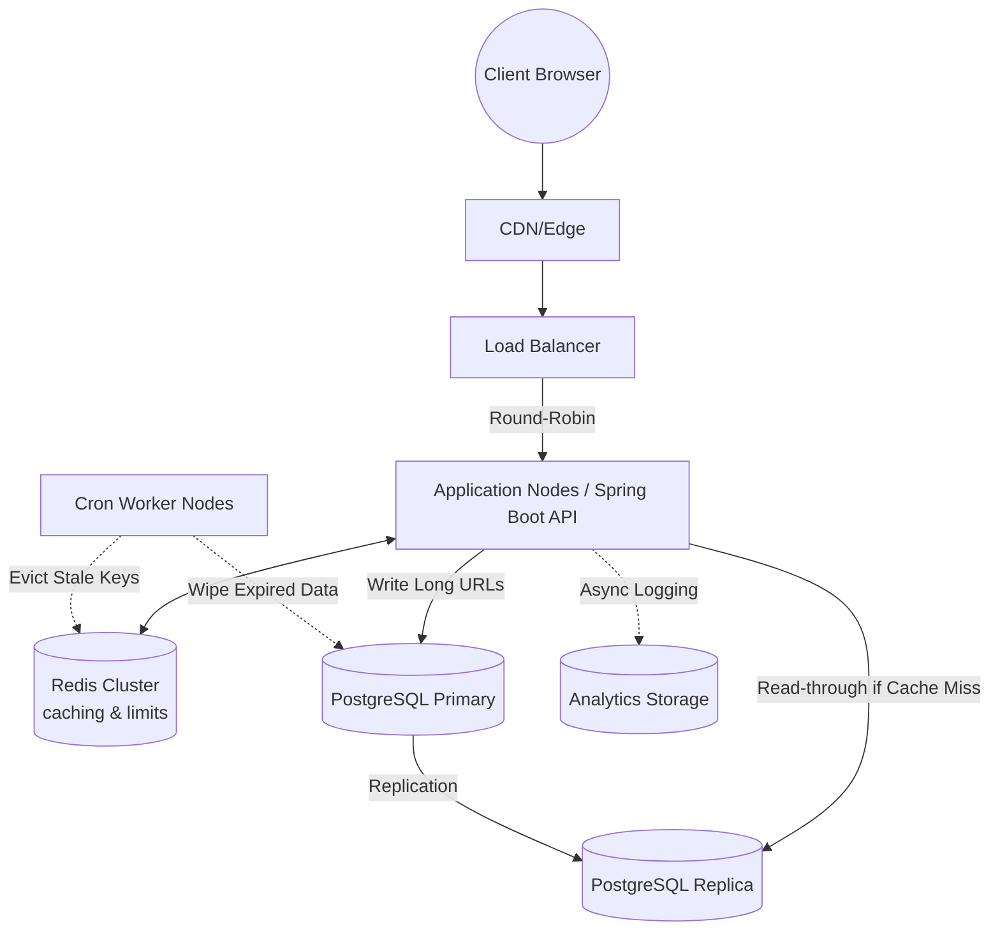

# High-Level Architecture & Design (HLD)
**URL Shortening Service**

This document outlines the high-level system architecture, core components, data models, and scale considerations for the Enterprise URL Shortener Service.

---

## 1. System Requirements & Goals

### Functional Requirements
- **Shortening**: Given a long URL, generate a shorter alias.
- **Custom Aliases**: Users can optionally define a custom short code.
- **Redirection**: When a user visits the short URL, they are immediately redirected to the original long URL.
- **Expiration**: Short links can have an explicit time-to-live (TTL) and expire.
- **Analytics**: The system must track usage patterns, click counts, geolocations/IP metadata, and referrers.

### Non-Functional Requirements
- **High Availability**: Redirection must be highly available (99.99% uptime). Read volume outpaces write volume significantly (100:1 read-to-write ratio).
- **Extremely Low Latency**: URL redirection should operate within < 10ms to provide a seamless user experience.
- **Unpredictability**: Short codes should be unpredictable to prevent malicious enumeration.

---

## 2. High-Level System Architecture

To meet our non-functional requirements of high availability and low latency, an asynchronous micro-caching strategy is combined with a resilient datastore.

### Component Roles

1. **Load Balancer**: Distributes incoming read/write traffic across available application nodes. Protects the API from volumetric attacks.
2. **Application Nodes (Spring Boot)**: Stateless service endpoints capable of auto-scaling. Business logic involving encoding, parameter sanitization, and DB querying sits here.
3. **Redis Cluster (Caching)**: 
   - Uses an LRU (Least Recently Used) cache eviction policy.
   - Stores `shortCode ↔ longUrl` mappings heavily accelerating redirection speed and reducing SQL queries.
   - **Rate Limiting**: Stores `Bucket4j` tokens tracked by Client IP (preventing API abuse).
4. **PostgreSQL**: Rigid, relational state of truth for the links. Utilizes ACID compliance to ensure no duplicate custom aliases register concurrently.
5. **Analytics Engine / DB**: Logs IP mappings, HTTP constraints, and aggregations.
6. **Cron Workers**: Off-loaded daemon processes handling cleanup services (purging TTL-expired URLs to preserve disk payload).

---

## 3. Data Models (Schema Design)

The system is powered by two primary SQL Tables managed by **Flyway**:

### `urls` Table
Maintains the mapping index alongside TTL values.

| Column | Type | Constraints | Description |
| :--- | :--- | :--- | :--- |
| `id` | BIGSERIAL | Primary Key | Auto-incrementing identifier used for Base62 logic. |
| `short_code` | VARCHAR(15) | UNIQUE, Indexed | The generated/custom alias payload. |
| `long_url` | TEXT | Not Null | The original destination. |
| `created_at` | TIMESTAMP | Not Null | Creation boundary. |
| `expiration_time` | TIMESTAMP | Nullable | Optional TTL boundary. If past, 410 Gone is returned. |

### `click_events` Table
Normalizes the traffic analytics map to the URL payload. 

| Column | Type | Constraints | Description |
| :--- | :--- | :--- | :--- |
| `id` | BIGSERIAL | Primary Key | Auto-increment identifier. |
| `short_code` | VARCHAR(15) | Indexed, FK | Foreign key mapped to the URL payload. |
| `click_timestamp`| TIMESTAMP | Not Null | Specific hit timing. |
| `ip_address` | VARCHAR(45) | Nullable | Encrypted/Hashed IP location details. |
| `user_agent` | TEXT | Nullable | Raw metadata indicating Browser and OS. |

---

## 4. Key Design Decisions

### 1. Base62 Encoding 
Base62 (`[A-Z, a-z, 0-9]`) is utilized for alias generation. A length of 7 characters gives us `62 ^ 7 = ~3.5 Trillion` combinations, which guarantees a near-limitless supply of short codes securely avoiding integer collision compared to simple hashing. 
*Flow: Save new URL -> Retrieve DB Sequence ID -> Encode ID to Base62 -> Assign to Alias.*

### 2. Multi-Tier Cache Layer Strategy
Given our heavy Read-To-Write constraints, scaling SQL replicas alone is expensive. URL redirection queries flow natively through **Redis**.
* **Cache Miss Strategy:** Read-through proxy. If Redis misses, query PostgreSQL. If Postgre retrieves data, aggressively cache it to Redis with an expiration metric.
* **Cache Eviction Strategy:** Handled intelligently through LRU coupled with strict manual invalidations on manual URL deletion. 

### 3. Rate Limiting Execution (Bucket4j)
To prevent brute-forcing custom alias tables, **Bucket4j** restricts creation and lookup APIs logically (e.g., maximum 20 requests per minute per IP via Redis-backed token buckets). 

### 4. Background Data Purging
Expired URLs are NOT aggressively deleted synchronously upon timeout. A cron `CleanupService` runs batched jobs hourly, resolving the cleanup load asynchronously across distributed replicas without locking user IO operations.
